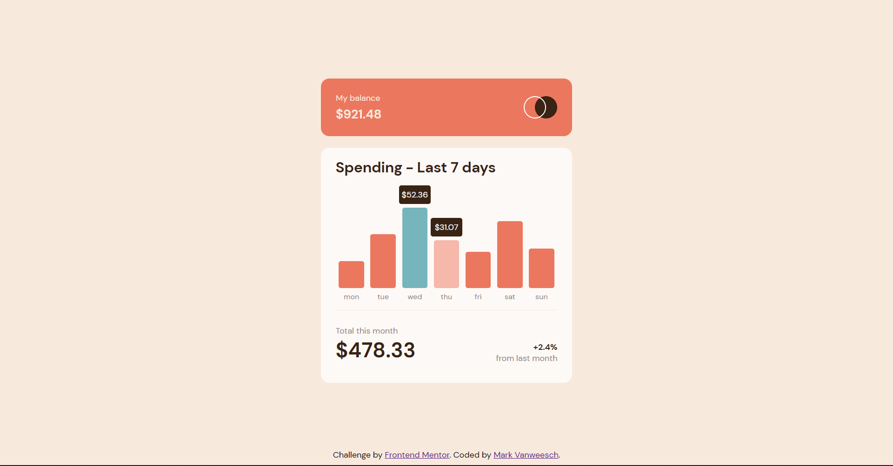
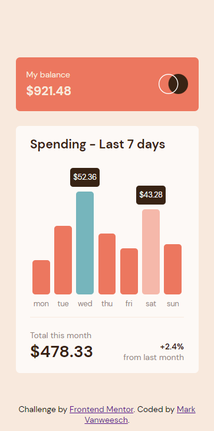

# Frontend Mentor - Expenses chart component solution

This is a solution to the [Expenses chart component challenge on Frontend Mentor](https://www.frontendmentor.io/challenges/expenses-chart-component-e7yJBUdjwt). Frontend Mentor challenges help you improve your coding skills by building realistic projects. 

## Table of contents

- [Overview](#overview)
  - [The challenge](#the-challenge)
  - [Screenshot](#screenshot)
  - [Links](#links)
- [My process](#my-process)
  - [Built with](#built-with)
  - [What I learned](#what-i-learned)
  - [Continued development](#continued-development)
  - [Useful resources](#useful-resources)
- [Author](#author)

## Overview

### The challenge

Users should be able to:

- View the bar chart and hover over the individual bars to see the correct amounts for each day
- See the current day’s bar highlighted in a different colour to the other bars
- View the optimal layout for the content depending on their device’s screen size
- See hover states for all interactive elements on the page
- **Bonus**: Use the JSON data file provided to dynamically size the bars on the chart

### Screenshot

Desktop:



Mobile:



### Links

- Solution URL: [Add solution URL here](https://your-solution-url.com)
- Live Site URL: [Add live site URL here](https://your-live-site-url.com)

## My process

### Built with

- CSS custom properties
- Flexbox
- CSS Grid
- Fetch API on JSON file
- JS Loops

### What I learned

How to use a JSON file in JS. Though I'm not completely understanding it yet. The bars, values and weekdays are dynamicaly generated depending on the data inside the JSON file.

This is how the height of the bars is calculated. The maximun heigt of a bar can be 174px, which the bar with the highest value will take. The other bars take a percentage relative to their value as height. I also added a little animation when loading the page.

```css
@keyframes bar-animation {
  0% {height: 0px;} 
}

.bar-middle {
  max-height: 100%;
  width: 80%;
  background-color: var(--clr-primary-red);
  border-radius: 5px;

  animation: bar-animation 1000ms ease-out;
}
```
```js
let highest = Math.max(...amountArr);
        for (let j in dataArr) {
          let height = Math.round((174 / highest) * dataArr[j]["amount"]);
          height = height.toString() + "px";
          bars[j].style.height = height;
```

### Continued development

I want to learn more about how to use JSON files, the fetch API and async. I got it working in this example, but I am sure this is not the best practice to using it.
Also to learn JS methonds like map() better. This way loops wouldn't have been used as much and should make the JS code cleaner.

### Useful resources

- [w3schools.com](https://www.w3schools.com/jsref/api_fetch.asp) - This helped me on how to use the fetch API and get the JSON data.

## Author

- Website - [Mark Vanweersch](https://markvanweersch.github.io/)
- Frontend Mentor - [@MarkVanweersch](https://www.frontendmentor.io/profile/MarkVanweersch)